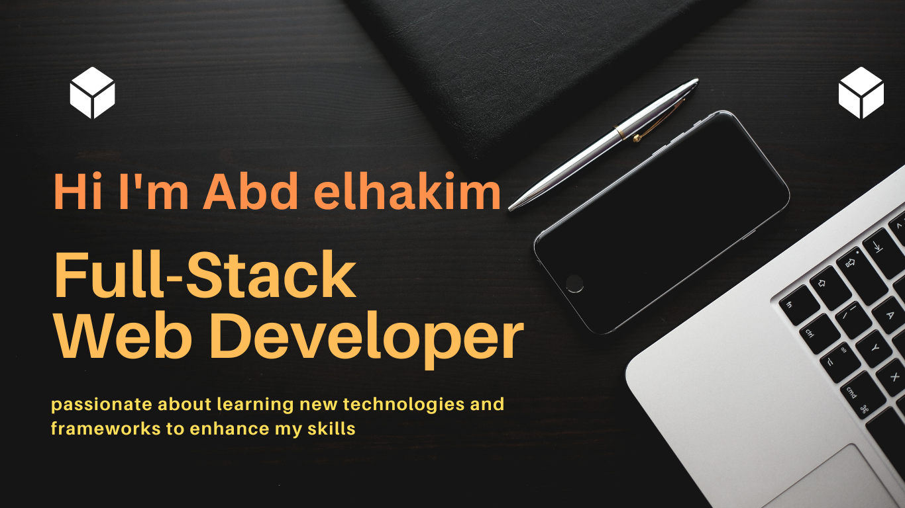

### Hi there 👋

  

# 💫 About Me:

I'm a Full-Stack Developer from Egypt, currently enrolled in the Microverse coding bootcamp. I'm passionate about learning new things and always looking for new challenges. In my free time, I enjoy drinking tea and watching anime, movies, and series.

<!-- # 🏢 Work Experience:

- **Software Developer, Company Name** - *Month Year to Month Year*
    - Brief description of your responsibilities and achievements in this role.
    - Technologies used: JavaScript, React, etc.

- **Junior Developer, Company Name** - *Month Year to Month Year*
    - Brief description of your responsibilities and achievements in this role.
    - Technologies used: HTML, CSS, etc. -->

# 📫 How to Reach Me:

- Email: [your-email@example.com](mailto:abdozayan12@gmail.com)
- LinkedIn: [Your Name](https://www.linkedin.com/in/abdozayan/)

# 📚 My Projects:

<!-- - **Project Name**
    - Description: Brief description of the project.
    - Tech Stack: JavaScript, React, etc.
    - [Live Demo](https://www.example.com)
    - [Code Repository](https://github.com/yourusername/projectname)

- **Project Name**
    - Description: Brief description of the project.
    - Tech Stack: HTML, CSS, etc.
    - [Live Demo](https://www.example.com)
    - [Code Repository](https://github.com/yourusername/projectname) -->

    # 💻 Skills:

## Programming Languages:
- Html
- JavaScript
- Ruby

## Frameworks:
- React
- Rails

## Tools:
- Git
- VS Code

<!-- # 💻 Tech Stack:

  
 
 
 
 

  

 -->

# 🤝 Contributions:

<!-- - **[Project Name](https://github.com/username/projectname)**
    - Brief description of your contributions to this project.

- **[Project Name](https://github.com/username/projectname)**
    - Brief description of your contributions to this project. -->

# 📊 GitHub Stats:

<!-- 
  -->

<!-- 

 -->

<!-- 

 -->

 </a>

 
<!-- # 📊 GitHub Stats: -->
<!-- 
 -->
<!-- 
 -->

### ✍️ Random Dev Quote

---
